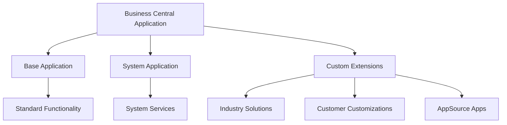

# 

---

# Comprehensive Coding Guidelines for AL Language: Business Central 2024 Wave 2

This extensive documentation provides detailed coding guidelines, best practices, and architectural insights for AL language development in Business Central 2024 Wave 2 (version 25). It offers a structured approach to understanding AL language components, extension development patterns, and implementation strategies to ensure code quality, performance, and maintainability.

## 1. Introduction

### 1.1 Purpose and Scope

The AL language (Application Language) is the successor to C/AL and serves as the primary programming language for extending and customizing Microsoft Dynamics 365 Business Central. These guidelines aim to establish standardized practices for AL development, ensuring consistency, maintainability, and performance across Business Central extensions. The document covers syntax rules, object structures, extension patterns, and best practices applicable to Business Central 2024 Wave 2 (version 25).

These guidelines target multiple audiences, including AI coding agents (like Cline and Cursor), junior to mid-level AL developers, development teams establishing coding standards, and solution architects designing Business Central extensions. By following these standards, developers can create robust, maintainable, and performant extensions that leverage the full capabilities of the Business Central platform.

### 1.2 Document Conventions

Throughout this document, we use the following conventions:

- **Bold text** for emphasizing important concepts and terms
- Code blocks for AL code examples
- Mermaid diagrams for visual explanations of architecture and processes
- Hierarchical section organization moving from fundamentals to advanced topics
- Citations to Microsoft official documentation where applicable

Each major topic follows a consistent progression:

1. Fundamentals (junior level)
2. Advanced Techniques (mid-level)
3. Expert Considerations (senior level)

### 1.3 Version Compatibility

These guidelines are specifically tailored for Business Central 2024 Wave 2 (version 25), which is the 11th major release that is fully AL-based. While many principles apply to earlier versions, specific features, syntax, and patterns may have changed from previous releases. Business Central 2019 release wave 2 (version 15) marked the complete transition from C/AL to AL, with C/SIDE being deprecated. Since then, Business Central has become exclusively extension-based, with the base application delivered as an AL extension and system functionality moved into separate modules within the System Application extension[^6].

For projects using previous versions, refer to the Upgrade path section for guidance on migration strategies.

### 1.4 How to Use This Guide

This guide is designed to be both a learning resource and a reference manual:

- **For beginners**: Start with the fundamentals sections of each topic to build a strong foundation.
- **For mid-level developers**: Focus on advanced techniques to refine your skills and improve code quality.
- **For experts**: Review expert considerations to optimize your extensions and follow best practices.
- **For teams**: Use this guide to establish consistent coding standards and practices across your development team.

Reference the appropriate sections based on your current task, whether you're designing a new extension, optimizing existing code, or learning specific aspects of AL development.

## 2. AL Language Fundamentals

### 2.1 Core Architecture

#### Fundamentals

AL is an object-based programming language specifically designed for building business applications in Microsoft Dynamics 365 Business Central. It replaced the legacy C/AL language to provide improved capabilities and compatibility with modern development practices[^8].



The AL development environment is built around Visual Studio Code with the AL Language extension, which provides modern development features like IntelliSense, debugging, and deployment integration. This setup allows developers to create extensions—modular add-ons that integrate seamlessly with Business Central without modifying the base application[^8][^19].

The core architecture follows these principles:

1. **Object-based design**: All functionality in Business Central is encapsulated in objects (Tables, Pages, Codeunits, Reports, etc.)
2. **Extension model**: Customizations are built as extensions rather than modifying base code
3. **Event-driven architecture**: Business logic is often triggered by events, allowing for loose coupling
4. **Metadata-driven UI**: User interfaces are defined declaratively through Page objects

#### Advanced Techniques

The AL architecture employs a layered approach to separate concerns:


The architecture promotes:

1. **Separation of concerns**: Each object has a specific responsibility
2. **Modularity**: Functionality is encapsulated in discrete, reusable components
3. **Extensibility**: Standard objects can be extended without modification
4. **Upgradability**: Clean separation between base and custom code ensures smooth upgrades

#### Expert Considerations

When working with the AL architecture:

1. **Dependency management** is critical for maintainable extensions. Minimize dependencies between extensions to reduce coupling and improve resilience.
2. **Layered design** helps isolate business logic from data access and presentation concerns.
3. **Extension boundaries** should be carefully planned to align with business domains.
4. **Backward compatibility** should be maintained when designing interfaces and events.

Extensions should be designed with clear boundaries, minimizing interdependencies. This approach allows for greater flexibility in deployment, maintenance, and upgrades. Experienced developers should focus on creating reusable patterns that can be applied across multiple extensions[^19].

### 2.2 Syntax Rules

#### 2.2.1 General Syntax

##### Fundamentals

AL syntax follows specific rules that ensure readability and consistency:

1. **Case sensitivity**: AL is not case-sensitive for identifiers, but following case conventions is recommended for readability.
2. **Statement termination**: Statements end with a semicolon (`;`).
3. **Code blocks**: Enclosed in curly braces `{ }` with each brace on a new line.
4. **Indentation**: Four spaces per indentation level is recommended[^4].

Basic AL code structure example:

```al
// This is a simple procedure in AL
procedure CalculateTotal(Amount: Decimal; Quantity: Integer): Decimal
begin
    // Return the total amount
    exit(Amount * Quantity);
end;
```

Keywords in AL should be all lowercase, while built-in methods and types follow PascalCase[^4]. For example:

```al
if customer.Find('-') then begin
    repeat
        TotalAmount += Customer."Outstanding Amount";
    until Customer.Next() = 0;
end;
```


##### Advanced Techniques

For more complex code structures, AL provides various control structures:

```al
// Example of more complex AL syntax
procedure ProcessCustomers(var Customer: Record Customer; MinimumAmount: Decimal)
var
    TotalAmount: Decimal;
    CustomerCount: Integer;
begin
    // Using the with statement for cleaner code
    with Customer do begin
        if Find('-') then
            repeat
                if "Outstanding Amount" >= MinimumAmount then begin
                    TotalAmount += "Outstanding Amount";
                    CustomerCount += 1;
                end;
            until Next() = 0;
    end;
    
    // Conditional logic
    case CustomerCount of
        0:
            Message('No customers found with outstanding amount >= %1', MinimumAmount);
        1:
            Message('Found 1 customer with total outstanding amount %1', TotalAmount);
        else
            Message('Found %1 customers with total outstanding amount %2', 
                    CustomerCount, TotalAmount);
    end;
end;
```

AL also supports the ternary (conditional) operator since Business Central 2024 Wave 2 (version 25), which can make code more concise[^7]:

```al
// Without the ternary operator
procedure GetBooleanText(b: Boolean): Text 
begin 
    if b then 
        exit('True') 
    else 
        exit('False'); 
end;

// With the ternary operator
procedure GetBooleanString(b: Boolean): Text 
begin 
    exit(b ? 'True' : 'False'); 
end;
```


##### Expert Considerations

Experienced developers should focus on writing clean, maintainable code:

1. **Limit line length** for improved readability, though there's no strict limit.
2. **Group related logic** into separate procedures for improved maintainability.
3. **Avoid deep nesting** of control structures to reduce complexity.
4. **Use descriptive variable names** that clearly communicate purpose.

For optimal performance and readability in complex scenarios:

```al
// Example of well-structured complex logic
procedure ProcessSalesOrders(var SalesHeader: Record "Sales Header")
var
    SalesLine: Record "Sales Line";
    Customer: Record Customer;
    ItemLedgerEntry: Record "Item Ledger Entry";
    TotalAmount: Decimal;
    ItemsProcessed: Integer;
begin
    // Validate input
    if SalesHeader.IsEmpty() then
        exit;
        
    // Process each sales order
    with SalesHeader do begin
        SetAutoCalcFields("Amount Including VAT");
        if FindSet() then
            repeat
                // Get customer details for the sales order
                if Customer.Get("Sell-to Customer No.") then
                    ValidateCustomerCredit(Customer, "Amount Including VAT");
                
                // Process the sales lines
                SalesLine.SetRange("Document Type", "Document Type");
                SalesLine.SetRange("Document No.", "No.");
                if SalesLine.FindSet() then
                    ProcessSalesLines(SalesLine, ItemsProcessed, TotalAmount);
                    
                // Update statistics
                UpdateOrderStatistics("No.", ItemsProcessed, TotalAmount);
            until Next() = 0;
    end;
end;

// Helper procedure to increase readability and maintainability
local procedure ProcessSalesLines(var SalesLine: Record "Sales Line"; var ItemsProcessed: Integer; var TotalAmount: Decimal)
begin
    repeat
        // Processing logic for individual lines
        TotalAmount += SalesLine."Line Amount";
        ItemsProcessed += 1;
    until SalesLine.Next() = 0;
end;
```


#### 2.2.2 Object Declaration Patterns

##### Fundamentals

AL objects follow specific declaration patterns. Here's the basic structure for various object types:

**Table object:**

```al
table 50100 "My Customer"
{
    DataClassification = CustomerContent;
    
    fields
    {
        field(1; "No."; Code[^20])
        {
            Caption = 'No.';
            DataClassification = CustomerContent;
        }
        field(2; Name; Text[^100])
        {
            Caption = 'Name';
            DataClassification = CustomerContent;
        }
    }
    
    keys
    {
        key(PK; "No.")
        {
            Clustered = true;
        }
    }
}
```

**Page object:**

```al
page 50100 "My Customer Card"
{
    PageType = Card;
    SourceTable = "My Customer";
    
    layout
    {
        area(Content)
        {
            group(General)
            {
                field("No."; Rec."No.")
                {
                    ApplicationArea = All;
                    ToolTip = 'Specifies the customer number.';
                }
                field(Name; Rec.Name)
                {
                    ApplicationArea = All;
                    ToolTip = 'Specifies the customer name.';
                }
            }
        }
    }
}
```

**Codeunit object:**

```al
codeunit 50100 "My Business Logic"
{
    trigger OnRun()
    begin
        // Main logic goes here
    end;
    
    procedure CalculateDiscount(Amount: Decimal): Decimal
    begin
        // Calculation logic
        exit(Amount * 0.1);
    end;
}
```


##### Advanced Techniques

Extension objects follow a similar pattern but extend existing objects:

**Table extension:**

```al
tableextension 50100 "My Customer Ext" extends Customer
{
    fields
    {
        field(50100; "My Custom Field"; Text[^50])
        {
            Caption = 'My Custom Field';
            DataClassification = CustomerContent;
        }
    }
}
```

**Page extension:**

```al
pageextension 50100 "My Customer Card Ext" extends "Customer Card"
{
    layout
    {
        addafter(Name)
        {
            field("My Custom Field"; Rec."My Custom Field")
            {
                ApplicationArea = All;
                ToolTip = 'Specifies a custom field value.';
            }
        }
    }
    
    actions
    {
        addafter("F&unctions")
        {
            action("My Custom Action")
            {
                ApplicationArea = All;
                Caption = 'Custom Action';
                Image = NewItem;
                ToolTip = 'Executes a custom action.';
                
                trigger OnAction()
                begin
                    // Action logic
                end;
            }
        }
    }
}
```


##### Expert Considerations

When declaring objects, experts should consider:

1. **Object dependencies**: Minimize dependencies between custom objects to reduce coupling.
2. **Extension points**: Use event publishers for extending functionality.
3. **Reusability**: Design objects with reuse in mind.
4. **Upgradability**: Ensure extensions can survive upgrades of the base application.

Example of a well-designed codeunit with event publishers:

```al
codeunit 50100 "Sales Document Processing"
{
    // Using procedure-based event pattern for flexibility
    procedure BeforePostSalesDocument(var SalesHeader: Record "Sales Header")
    var
        SalesDocumentEvents: Codeunit "Sales Document Events";
    begin
        SalesDocumentEvents.OnBeforePostSalesDocument(SalesHeader);
    end;
    
    procedure AfterPostSalesDocument(var SalesHeader: Record "Sales Header"; var SalesInvoiceHeader: Record "Sales Invoice Header")
    var
        SalesDocumentEvents: Codeunit "Sales Document Events";
    begin
        SalesDocumentEvents.OnAfterPostSalesDocument(SalesHeader, SalesInvoiceHeader);
    end;
    
    // Main processing logic
    procedure PostSalesDocument(var SalesHeader: Record "Sales Header")
    var
        SalesInvoiceHeader: Record "Sales Invoice Header";
    begin
        // Pre-processing
        BeforePostSalesDocument(SalesHeader);
        
        // Core posting logic
        // ...
        
        // Post-processing
        AfterPostSalesDocument(SalesHeader, SalesInvoiceHeader);
    end;
}

// Event publisher codeunit
codeunit 50101 "Sales Document Events"
{
    // Event publishers
    [IntegrationEvent(false, false)]
    procedure OnBeforePostSalesDocument(var SalesHeader: Record "Sales Header")
    begin
    end;
    
    [IntegrationEvent(false, false)]
    procedure OnAfterPostSalesDocument(var SalesHeader: Record "Sales Header"; var SalesInvoiceHeader: Record "Sales Invoice Header")
    begin
    end;
}
```


#### 2.2.3 Data Types Hierarchy

##### Fundamentals

AL supports various data types to handle different kinds of information. The main categories include:

1. **Primitive types**:
    - Text and Code (fixed-length strings)
    - Integer, Decimal, BigInteger
    - Boolean
    - Date, Time, DateTime, Duration
    - Guid
2. **Complex types**:
    - Record (represents table data)
    - Page (represents UI elements)
    - Report (represents reports)
    - XmlPort (represents data import/export)
    - Query (represents database queries)
3. **Special types**:
    - Variant (can hold any data type)
    - RecordRef and FieldRef (used for generic table manipulation)
    - JsonObject, JsonArray, JsonValue, JsonToken (for JSON handling)

Example of variable declarations:

```al
var
    CustomerName: Text[^100];  // Text with max length 100
    IsActive: Boolean;        // True/False value
    Amount: Decimal;          // Decimal number
    StartDate: Date;          // Date value
    CustomerRec: Record Customer;  // Record variable
    CustomerRef: RecordRef;   // Generic record reference
```


##### Advanced Techniques

For advanced scenarios, AL provides more sophisticated data handling:

1. **Temporary records** for in-memory operations:
```al
var
    TempCustomer: Record Customer temporary;
```

2. **RecordRef/FieldRef** for dynamic record manipulation:
```al
procedure UpdateFieldByName(RecVariant: Variant; FieldName: Text; NewValue: Variant)
var
    RecRef: RecordRef;
    FldRef: FieldRef;
begin
    RecRef.GetTable(RecVariant);
    FldRef := RecRef.Field(RecRef.FieldIndex(FieldName));
    FldRef.Validate(NewValue);
    RecRef.Modify();
end;
```

3. **JSON handling** for API integration:
```al
procedure CreateJsonCustomer(Customer: Record Customer): JsonObject
var
    CustomerJson: JsonObject;
begin
    CustomerJson.Add('no', Customer."No.");
    CustomerJson.Add('name', Customer.Name);
    CustomerJson.Add('address', Customer.Address);
    CustomerJson.Add('phone', Customer."Phone No.");
    exit(CustomerJson);
end;
```


##### Expert Considerations

1. **Type conversion** should be handled carefully to avoid data loss or runtime errors.
2. **Memory management** is important, especially when working with large datasets or temporary records.
3. **Dynamic programming** with RecordRef/FieldRef should be used judiciously due to performance overhead.

Example of expert-level data handling:

```al
procedure ProcessRecordsGeneric(TableNo: Integer; FilterFieldNo: Integer; FilterValue: Text): Integer
var
    RecRef: RecordRef;
    FldRef: FieldRef;
    ProcessedCount: Integer;
begin
    // Open the table dynamically
    RecRef.Open(TableNo);
    
    // Apply filter dynamically
    FldRef := RecRef.Field(FilterFieldNo);
    FldRef.SetFilter(FilterValue);
    
    // Process records
    if RecRef.FindSet() then
        repeat
            if ProcessRecord(RecRef) then
                ProcessedCount += 1;
        until RecRef.Next() = 0;
    
    RecRef.Close();
    exit(ProcessedCount);
end;

local procedure ProcessRecord(var RecRef: RecordRef): Boolean
var
    ProcessingResult: Boolean;
begin
    // Process the record based on its type
    case RecRef.Number of
        Database::Customer:
            ProcessingResult := ProcessCustomer(RecRef);
        Database::Vendor:
            ProcessingResult := ProcessVendor(RecRef);
        Database::Item:
            ProcessingResult := ProcessItem(RecRef);
        else
            ProcessingResult := ProcessGeneric(RecRef);
    end;
    
    exit(ProcessingResult);
end;
```


## 3. Core Components

### 3.1 Tables

#### 3.1.1 Structure and Properties

##### Fundamentals

Tables are the foundation of any Business Central application, representing the database structure for storing and retrieving data. A table consists of fields, keys, and associated business logic through triggers.

Basic table structure:

```al
table 50100 "Customer Loyalty"
{
    Caption = 'Customer Loyalty';
    DataClassification = CustomerContent;
    
    fields
    {
        field(1; "Customer No."; Code[^20])
        {
            Caption = 'Customer No.';
            DataClassification = CustomerContent;
            TableRelation = Customer."No.";
        }
        field(2; "Loyalty Level"; Enum "Loyalty Level")
        {
            Caption = 'Loyalty Level';
            DataClassification = CustomerContent;
        }
        field(3; "Points"; Integer)
        {
            Caption = 'Points';
            DataClassification = CustomerContent;
            MinValue = 0;
        }
        field(4; "Last Purchase Date"; Date)
        {
            Caption = 'Last Purchase Date';
            DataClassification = CustomerContent;
        }
    }
    
    keys
    {
        key(PK; "Customer No.")
        {
            Clustered = true;
        }
        key(LoyaltyLevel; "Loyalty Level", Points)
        {
        }
    }
    
    trigger OnInsert()
    begin
        // Logic for new record insertion
    end;
    
    trigger OnModify()
    begin
        // Logic for existing record modification
    end;
}
```

Key components of a table:

1. **Fields**: Define the columns that store data
2. **Keys**: Define primary and secondary keys for indexing
3. **Triggers**: Contain code that runs during specific database operations
4. **Properties**: Control behavior of the table and its fields

##### Advanced Techniques

Tables can implement more advanced features:

1. **Field validation logic**:
```al
field(3; "Points"; Integer)
{
    Caption = 'Points';
    DataClassification = CustomerContent;
    MinValue = 0;
    
    trigger OnValidate()
    begin
        if (Rec."Points" >= 1000) and (xRec."Points" < 1000) then
            Rec.Validate("Loyalty Level", "Loyalty Level"::Gold);
    end;
}
```

2. **FlowFields** for calculated values:
```al
field(5; "Total Purchase Amount"; Decimal)
{
    Caption = 'Total Purchase Amount';
    FieldClass = FlowField;
    CalcFormula = sum("Sales Line"."Amount" where("Sell-to Customer No." = field("Customer No.")));
    Editable = false;
}
```

3. **FlowFilters** for dynamic calculations:
```al
field(6; "Period Purchase Amount"; Decimal)
{
    Caption = 'Period Purchase Amount';
    FieldClass = FlowField;
    CalcFormula = sum("Sales Line"."Amount" where(
        "Sell-to Customer No." = field("Customer No."),
        "Posting Date" = field(FILTER("Date Filter"))));
    Editable = false;
}
field(7; "Date Filter"; Date)
{
    Caption = 'Date Filter';
    FieldClass = FlowFilter;
}
```


##### Expert Considerations

For optimal table design:

1. **Normalization**: Follow database normalization principles to avoid redundancy.
2. **Field grouping**: Group related fields together for better readability.
3. **Indexed retrieval**: Design keys to support common filtering and sorting operations.
4. **Data classification**: Properly classify data for GDPR compliance.

Example of a well-designed table with expert considerations:

```al
table 50101 "Sales Promotion"
{
    Caption = 'Sales Promotion';
    DataClassification = CustomerContent;
    
    fields
    {
        field(1; "Code"; Code[^20])
        {
            Caption = 'Code';
            DataClassification = CustomerContent;
            NotBlank = true;
        }
        field(2; "Description"; Text[^100])
        {
            Caption = 'Description';
            DataClassification = CustomerContent;
        }
        field(3; "Start Date"; Date)
        {
            Caption = 'Start Date';
            DataClassification = CustomerContent;
            
            trigger OnValidate()
            begin
                ValidateDateRange();
            end;
        }
        field(4; "End Date"; Date)
        {
            Caption = 'End Date';
            DataClassification = CustomerContent;
            
            trigger OnValidate()
            begin
                ValidateDateRange();
            end;
        }
        field(5; "Discount Type"; Enum "Discount Type")
        {
            Caption = 'Discount Type';
            DataClassification = CustomerContent;
        }
        field(6; "Discount Value"; Decimal)
        {
            Caption = 'Discount Value';
            DataClassification = CustomerContent;
            MinValue = 0;
            
            trigger OnValidate()
            begin
                ValidateDiscountValue();
            end;
        }
        field(7; "Minimum Amount"; Decimal)
        {
            Caption = 'Minimum Amount';
            DataClassification = CustomerContent;
            MinValue = 0;
        }
        field(8; "Status"; Enum "Promotion Status")
        {
            Caption = 'Status';
            DataClassification = CustomerContent;
            Editable = false;
        }
        field(9; "Created By"; Code[^50])
        {
            Caption = 'Created By';
            DataClassification = EndUserIdentifiableInformation;
            Editable = false;
        }
        field(10; "Creation Date"; DateTime)
        {
            Caption = 'Creation Date';
            DataClassification = CustomerContent;
            Editable = false;
        }
        
        // FlowFields for analytics
        field(20; "Number of Uses"; Integer)
        {
            Caption = 'Number of Uses';
            FieldClass = FlowField;
            CalcFormula = count("Sales Line" where("Promotion Code" = field(Code)));
            Editable = false;
        }
        field(21; "Total Discount Amount"; Decimal)
        {
            Caption = 'Total Discount Amount';
            FieldClass = FlowField;
            CalcFormula = sum("Sales Line"."Line Discount Amount" where("Promotion Code" = field(Code)));
            Editable = false;
        }
    }
    
    keys
    {
        key(PK; "Code")
        {
            Clustered = true;
        }
        key(Status; "Status", "Start Date")
        {
            // Optimized for finding active promotions
        }
        key(Date; "Start Date", "End Date")
        {
            // Optimized for date-based searches
        }
    }
    
    trigger OnInsert()
    begin
        "Created By" := UserId;
        "Creation Date" := CurrentDateTime;
        UpdateStatus();
    end;
    
    trigger OnModify()
    begin
        UpdateStatus();
    end;
    
    local procedure ValidateDateRange()
    begin
        if ("Start Date" <> 0D) and ("End Date" <> 0D) then
            if "End Date" < "Start Date" then
                Error('End Date cannot be earlier than Start Date');
        
        UpdateStatus();
    end;
    
    local procedure ValidateDiscountValue()
    begin
        if "Discount Type" = "Discount Type"::"Percentage Discount" then
            if "Discount Value" > 100 then
                Error('Percentage discount cannot exceed 100%');
    end;
    
    local procedure UpdateStatus()
    var
        CurrentDate: Date;
    begin
        CurrentDate := Today;
        
        if "Start Date" = 0D then
            "Status" := "Status"::Draft
        else if "Start Date" > CurrentDate then
            "Status" := "Status"::Pending
        else if ("End Date" <> 0D) and (CurrentDate > "End Date") then
            "Status" := "Status"::Expired
        else
            "Status" := "Status"::Active;
    end;
}
```


#### 3.1.2 Extension Patterns

##### Fundamentals

Table extensions allow adding fields and logic to existing tables without modifying the base application. This approach supports upgrade compatibility and side-by-side extensions.

Basic table extension:

```al
tableextension 50100 "Customer Extension" extends Customer
{
    fields
    {
        field(50100; "Loyalty Program"; Boolean)
        {
            Caption = 'Loyalty Program';
            DataClassification = CustomerContent;
        }
        field(50101; "Loyalty Points"; Integer)
        {
            Caption = 'Loyalty Points';
            DataClassification = CustomerContent;
        }
    }
}
```


##### Advanced Techniques

Table extensions can implement more sophisticated patterns:

1. **Extending table functionality** with triggers:
```al
tableextension 50100 "Customer Extension" extends Customer
{
    fields
    {
        field(50100; "Loyalty Program"; Boolean)
        {
            Caption = 'Loyalty Program';
            DataClassification = CustomerContent;
            
            trigger OnValidate()
            begin
                if not "Loyalty Program" then
                    "Loyalty Points" := 0;
            end;
        }
        field(50101; "Loyalty Points"; Integer)
        {
            Caption = 'Loyalty Points';
            DataClassification = CustomerContent;
        }
    }
    
    trigger OnAfterModify()
    begin
        if (Rec."Loyalty Program") and (Rec."Loyalty Points" >= 1000) then
            NotifyCustomerEligibility();
    end;
    
    local procedure NotifyCustomerEligibility()
    var
        NotificationMsg: Notification;
    begin
        NotificationMsg.Message := StrSubstNo('Customer %1 is eligible for premium status', Rec."No.");
        NotificationMsg.Scope := NotificationScope::LocalScope;
        NotificationMsg.Send();
    end;
}
```

2. **Adding new keys** for improved searching:
```al
tableextension 50101 "Item Extension" extends Item
{
    fields
    {
        field(50100; "Custom Category"; Code[^20])
        {
            Caption = 'Custom Category';
            DataClassification = CustomerContent;
            TableRelation = "Custom Category";
        }
    }
    
    keys
    {
        key(CustomCat; "Custom Category")
        {
        }
    }
}
```


##### Expert Considerations

For optimal table extension design:

1. **Field numbering**: Use a consistent numbering scheme for extension fields (e.g., starting from 50000).
2. **Performance impact**: Consider the performance impact of adding fields that might be used in common queries.
3. **Data migration**: Plan for data migration when adding mandatory fields.
4. **Event-based extensions**: Use event subscribers instead of directly extending triggers when possible.

Example of an expert-level table extension pattern:

```al
tableextension 50102 "Sales Header Extension" extends "Sales Header"
{
    fields
    {
        field(50100; "External Document ID"; Code[^30])
        {
            Caption = 'External Document ID';
            DataClassification = CustomerContent;
            
            trigger OnValidate()
            var
                SalesHeader: Record "Sales Header";
            begin
                if "External Document ID" = '' then
                    exit;
                
                // Check for duplicates
                SalesHeader.SetRange("External Document ID", "External Document ID");
                SalesHeader.SetFilter("No.", '<>%1', "No.");
                if not SalesHeader.IsEmpty then
                    Message('Warning: External Document ID %1 is already used on another sales document.', "External Document ID");
            end;
        }
        field(50101; "Campaign Code"; Code[^20])
        {
            Caption = 'Campaign Code';
            DataClassification = CustomerContent;
            TableRelation = Campaign;
        }
        field(50102; "Approval Status"; Enum "Custom Approval Status")
        {
            Caption = 'Approval Status';
            DataClassification = CustomerContent;
            Editable = false;
        }
    }
    
    fieldgroups
    {
        addlast(DropDown; "External Document ID")
        {
        }
    }
}

// Event subscriber codeunit for extended functionality
codeunit 50100 "Sales Document Management"
{
    // Using events instead of directly modifying triggers
    [EventSubscriber(ObjectType::Table, Database::"Sales Header", 'OnAfterInsertEvent', '', false, false)]
    local procedure OnAfterInsertSalesHeader(var Rec: Record "Sales Header")
    begin
        InitializeCustomFields(Rec);
    end;
    
    [EventSubscriber(ObjectType::Table, Database::"Sales Header", 'OnBeforeDeleteEvent', '', false, false)]
    local procedure OnBeforeDeleteSalesHeader(var Rec: Record "Sales Header")
    begin
        ValidateCustomDeletion(Rec);
    end;
    
    local procedure InitializeCustomFields(var SalesHeader: Record "Sales Header")
    begin
        // Initialize custom fields with default values
        SalesHeader."Approval Status" := SalesHeader."Approval Status"::Open;
        SalesHeader.Modify();
    end;
    
    local procedure ValidateCustomDeletion(var SalesHeader: Record "Sales Header")
    begin
        // Custom validation logic before deletion
        if SalesHeader."Approval Status" = SalesHeader."Approval Status"::Approved then
            Error('Cannot delete a sales document with Approved status');
    end;
}
```


#### 3.1.3 Performance Optimization

##### Fundamentals

Table performance is critical for Business Central applications. Basic performance optimization techniques include:

1. **Proper key design**: Create appropriate keys for common search patterns
2. **Filtering strategies**: Use efficient filters to reduce dataset size
3. **Field selection**: Retrieve only the fields you need

Basic filtering example:

```al
procedure GetCustomerBalance(CustomerNo: Code[^20]): Decimal
var
    Customer: Record Customer;
begin
    if Customer.Get(CustomerNo) then
        exit(Customer.Balance)
    else
        exit(0);
end;
```


##### Advanced Techniques

Advanced performance optimization techniques include:

1. **SetLoadFields**: Retrieve only necessary fields:
```al
procedure GetCustomerContact(CustomerNo: Code[^20]): Text
var
    Customer: Record Customer;
begin
    Customer.SetLoadFields("Primary Contact No.", "Contact Name");
    if Customer.Get(CustomerNo) then
        exit(Customer."Contact Name")
    else
        exit('');
end;
```

2. **SetRange/SetFilter**: Use efficient filters:
```al
procedure GetActiveItems(): Integer
var
    Item: Record Item;
begin
    Item.SetRange(Blocked, false);
    Item.SetFilter(Inventory, '>0');
    exit(Item.Count);
end;
```

3. **FindSet with ForUpdate**: Optimize record locking:
```al
procedure UpdateCustomerCreditLimits(CreditLimitPct: Decimal)
var
    Customer: Record Customer;
begin
    Customer.SetFilter("Credit Limit (LCY)", '>0');
    if Customer.FindSet(true, true) then
        repeat
            Customer."Credit Limit (LCY)" := Customer."Credit Limit (LCY)" * (1 + CreditLimitPct / 100);
            Customer.Modify();
        until Customer.Next() = 0;
end;
```


##### Expert Considerations

For optimal table performance:

1. **Bulk operations**: Use bulk insert/update when processing many records
2. **Temporary tables**: Use temporary tables for intermediate calculations
3. **SQL indexes**: Design keys with SQL performance in mind
4. **Query objects**: Use queries for complex data retrieval

Example of expert-level performance optimization:

```al
procedure ImportCustomerData(var TempBlob: Codeunit "Temp Blob"): Integer
var
    Customer: Record Customer;
    TempCustomer: Record Customer temporary;
    JsonArray: JsonArray;
    JsonToken: JsonToken;
    JsonObject: JsonObject;
    ImportCount: Integer;
    InStream: InStream;
    JsonText: Text;
begin
    // Read JSON data from blob
    TempBlob.CreateInStream(InStream);
    InStream.ReadText(JsonText);
    
    if not JsonArray.ReadFrom(JsonText) then
        Error('Invalid JSON format');
    
    // Process into temporary table first (faster than direct inserts)
    foreach JsonToken in JsonArray do begin
        JsonObject := JsonToken.AsObject();
        
        TempCustomer.Init();
        TempCustomer."No." := CopyStr(GetJsonValue(JsonObject, 'id'), 1, MaxStrLen(TempCustomer."No."));
        TempCustomer.Name := CopyStr(GetJsonValue(JsonObject, 'name'), 1, MaxStrLen(TempCustomer.Name));
        TempCustomer.Address := CopyStr(GetJsonValue(JsonObject, 'address'), 1, MaxStrLen(TempCustomer.Address));
        TempCustomer."Phone No." := CopyStr(GetJsonValue(JsonObject, 'phone'), 1, MaxStrLen(TempCustomer."Phone No."));
        TempCustomer.Insert();
        
        ImportCount += 1;
    end;
    
    // Now bulk insert from temporary table to actual table
    if TempCustomer.FindSet() then
        repeat
            if not Customer.Get(TempCustomer."No.") then begin
                Customer.Init();
                Customer := TempCustomer;
                Customer.Insert();
            end else begin
                Customer.Name := TempCustomer.Name;
                Customer.Address := TempCustomer.Address;
                Customer."Phone No." := TempCustomer."Phone No.";
                Customer.Modify();
            end;
        until TempCustomer.Next() = 0;
    
    exit(ImportCount);
end;

local procedure GetJsonValue(JsonObject: JsonObject; PropertyName: Text): Text
var
    JsonToken: JsonToken;
begin
    if JsonObject.Get(PropertyName, JsonToken) then
        exit(JsonToken.AsValue().AsText());
    
    exit('');
end;
```


### 3.2 Pages

#### 3.2.1 Page Types Comparison

##### Fundamentals

Pages are the primary UI components in Business Central, displaying data from tables and allowing user interaction. Different page types serve different purposes:

1. **Card pages**: Display and edit a single record in detail
2. **List pages**: Display multiple records in a tabular format
3. **Document pages**: Combine header and line information
4. **Worksheet pages**: Allow users to work with temporary data
5. **Role Center pages**: Serve as dashboards for specific roles

Basic list page example:

```al
page 50100 "Customer Loyalty List"
{
    PageType = List;
    SourceTable = "Customer Loyalty";
    CardPageId = "Customer Loyalty Card";
    Editable = false;
    UsageCategory = Lists;
    ApplicationArea = All;
    
    layout
    {
        area(Content)
        {
            repeater(GroupName)
            {
                field("Customer No."; Rec."Customer No.")
                {
                    ApplicationArea = All;
                    ToolTip = 'Specifies the customer number.';
                }
                field("Loyalty Level"; Rec."Loyalty Level")
                {
                    ApplicationArea = All;
                    ToolTip = 'Specifies the loyalty level of the customer.';
                }
                field("Points"; Rec."Points")
                {
                    ApplicationArea = All;
                    ToolTip = 'Specifies the loyalty points earned by the customer.';
                }
                field("Last Purchase Date"; Rec."Last Purchase Date")
                {
                    ApplicationArea = All;
                    ToolTip = 'Specifies the date of the customer''s last purchase.';
                }
            }
        }
        area(FactBoxes)
        {
            part(CustomerDetails; "Customer Details FactBox")
            {
                ApplicationArea = All;
                SubPageLink = "No." = field("Customer No.");
            }
        }
    }
    
    actions
    {
        area(Processing)
        {
            action(AwardPoints)
            {
                ApplicationArea = All;
                Caption = 'Award Points';
                Image = Add;
                ToolTip = 'Award additional loyalty points to the selected customer.';
                
                trigger OnAction()
                begin
                    // Action logic
                end;
            }
        }
    }
}
```

Card page example:

```al
page 50101 "Customer Loyalty Card"
{
    PageType = Card;
    SourceTable = "Customer Loyalty";
    
    layout
    {
        area(Content)
        {
            group(General)
            {
                field("Customer No."; Rec."Customer No.")
                {
                    ApplicationArea = All;
                    ToolTip = 'Specifies the customer number.';
                }
                field("Loyalty Level"; Rec."Loyalty Level")
                {
                    ApplicationArea = All;
                    ToolTip = 'Specifies the loyalty level of the customer.';
                }
                field("Points"; Rec."Points")
                {
                    ApplicationArea = All;
                    ToolTip = 'Specifies the loyalty points earned by the customer.';
                }
                field("Last Purchase Date"; Rec."Last Purchase Date")
                {
                    ApplicationArea = All;
                    ToolTip = 'Specifies the date of the customer''s last purchase.';
                }
            }
        }
    }
}
```


##### Advanced Techniques

Different page types can be used for more complex scenarios:

1. **Document pages** for header-line data:
```al
page 50102 "Sales Promotion Document"
{
    PageType = Document;
    SourceTable = "Sales Promotion";
    
    layout
    {
        area(Content)
        {
            group(General)
            {
                field("Code"; Rec."Code")
                {
                    ApplicationArea = All;
                    ToolTip = 'Specifies the promotion code.';
                }
                field("Description"; Rec."Description")
                {
                    ApplicationArea = All;
                    ToolTip = 'Specifies the description of the promotion.';
                }
                field("Discount Type"; Rec."Discount Type")
                {
                    ApplicationArea = All;
                    ToolTip = 'Specifies the type of discount.';
                }
                field("Discount Value"; Rec."Discount Value")
                {
                    ApplicationArea = All;
                    ToolTip = 'Specifies the discount value.';
                }
            }
            part(Lines; "Sales Promotion Lines")
            {
                ApplicationArea = All;
                SubPageLink = "Promotion Code" = field(Code);
            }
        }
    }
}
```

2. **Role Center pages** for personalized dashboards:
```al
page 50103 "Sales Manager Role Center"
{
    PageType = RoleCenter;
    
    layout
    {
        area(RoleCenter)
        {
            part(Headlines; "Sales Manager Headlines")
            {
                ApplicationArea = All;
            }
            part(SalesSummary; "Sales Summary Chart")
            {
                ApplicationArea = All;
            }
            part(OpenSalesDocuments; "Open Sales Documents")
            {
                ApplicationArea = All;
            }
            part(MyCustomers; "My Customers")
            {
                ApplicationArea = All;
            }
        }
    }
    
    actions
    {
        area(Embedding)
        {
            action(Customers)
            {
                ApplicationArea = All;
                Caption = 'Customers';
                RunObject = page "Customer List";
                ToolTip = 'View and manage customers.';
            }
            action(SalesOrders)
            {
                ApplicationArea = All;
                Caption = 'Sales Orders';
                RunObject = page "Sales Order List";
                ToolTip = 'View and manage sales orders.';
            }
        }
        area(Processing)
        {
            action(SalesReport)
            {
                ApplicationArea = All;
                Caption = 'Sales Report';
                RunObject = report "Customer - Sales List";
                ToolTip = 'View a sales report.';
            }
        }
    }
}
```


##### Expert Considerations

For optimal page design:

1. **Performance**: Minimize the number of fields and parts for faster loading
2. **User experience**: Group related fields logically
3. **Responsive design**: Design pages that work well on different screen sizes
4. **Consistency**: Follow Business Central UI patterns for familiarity

Example of an expert-level page design pattern:

```al
page 50104 "Customer Insight"
{
    PageType = Card;
    SourceTable = Customer;
    Caption = 'Customer Insight';
    InsertAllowed = false;
    DeleteAllowed = false;
    ModifyAllowed = false;
    LinksAllowed = false;
    
    layout
    {
        area(Content)
        {
            group(CustomerDetails)
            {
                Caption = 'Customer';
                
                field("No."; Rec."No.")
                {
                    ApplicationArea = All;
                    ToolTip = 'Specifies the customer number.';
                    StyleExpr = CustomerStyleExpr;
                }
                field(Name; Rec.Name)
                {
                    ApplicationArea = All;
                    ToolTip = 'Specifies the customer name.';
                }
                field("Phone No."; Rec."Phone No.")
                {
                    ApplicationArea = All;
                    ToolTip = 'Specifies the customer phone number.';
                }
                field("E-Mail"; Rec."E-Mail")
                {
                    ApplicationArea = All;
                    ToolTip = 'Specifies the customer email address.';
                }
            }
            
            group(FinancialInsight)
            {
                Caption = 'Financial Insight';
                
                field(Balance; Rec.Balance)
                {
                    ApplicationArea = All;
                    ToolTip = 'Specifies the customer balance.';
                    StyleExpr = BalanceStyleExpr;
                }
                field("Credit Limit (LCY)"; Rec."Credit Limit (LCY)")
                {
                    ApplicationArea = All;
                    ToolTip = 'Specifies the customer credit limit.';
                }
                field("Average Collection Period"; CalculateCollectionPeriod())
                {
                    ApplicationArea = All;
                    Caption = 'Average Collection Period (Days)';
                    ToolTip = 'Specifies the average time taken to collect payment from the customer.';
                }
                field("YTD Sales"; CalculateYTDSales())
                {
                    ApplicationArea = All;
                    Caption = 'Year-to-Date Sales';
                    ToolTip = 'Specifies the total sales to the customer this year.';
                }
            }
        }
        
        area(FactBoxes)
        {
            part(SalesHistory; "Sales History FactBox")
            {
                ApplicationArea = All;
                SubPageLink = "Sell-to Customer No." = field("No.");
            }
            part(CustomerStatistics; "Customer Statistics FactBox")
            {
                ApplicationArea = All;
                SubPageLink = "No." = field("No.");
            }
            systempart(Links; Links)
            {
                ApplicationArea = All;
            }
            systempart(Notes; Notes)
            {
                ApplicationArea = All;
            }
        }
    }
    
    actions
    {
        area(Navigation)
        {
            action(CustomerCard)
            {
                ApplicationArea = All;
                Caption = 'Customer Card';
                Image = Customer;
                RunObject = page "Customer Card";
                RunPageLink = "No." = field("No.");
                ToolTip = 'View the customer card.';
            }
            action(SalesHistory)
            {
                ApplicationArea = All;
                Caption = 'Sales History';
                Image = History;
                RunObject = page "Customer - Sales List";
                RunPageLink = "No." = field("No.");
                ToolTip = 'View the customer sales history.';
            }
        }
        area(Processing)
        {
            action(SendEmail)
            {
                ApplicationArea = All;
                Caption = 'Send Email';
                Image = Email;
                ToolTip = 'Send an email to the customer.';
                
                trigger OnAction()
                begin
                    // Email logic
                end;
            }
            action(CreateSalesQuote)
            {
                ApplicationArea = All;
                Caption = 'Create Sales Quote';
                Image = NewSalesQuote;
                ToolTip = 'Create a new sales quote for the customer.';
                
                trigger OnAction()
                begin
                    // Create quote logic
                end;
            }
        }
    }
    
    trigger OnAfterGetRecord()
    begin
        SetStyleExpressions();
    end;
    
    var
        CustomerStyleExpr: Text;
        BalanceStyleExpr: Text;
    
    local procedure SetStyleExpressions()
    begin
        // Set style expressions based on data
        if Rec.Blocked <> Rec.Blocked::" " then
            CustomerStyleExpr := 'Unfavorable'
        else
            CustomerStyleExpr := 'Standard';
            
        if (Rec.Balance > 0) and (Rec.Balance > Rec."Credit Limit (LCY)") and (Rec."Credit Limit (LCY)" > 0) then
            BalanceStyleExpr := 'Unfavorable'
        else if Rec.Balance < 0 then
            BalanceStyleExpr := 'Favorable'
        else
            BalanceStyleExpr := 'Standard';
    end;
    
    local procedure CalculateCollectionPeriod(): Decimal
    var
        CustomerLedgerEntry: Record "Cust. Ledger Entry";
        TotalDays: Decimal;
        EntryCount: Integer;
    begin
        CustomerLedgerEntry.SetRange("Customer No.", Rec."No.");
        CustomerLedgerEntry.SetRange("Document Type", CustomerLedgerEntry."Document Type"::Invoice);
        CustomerLedgerEntry.SetRange(Closed, true);
        CustomerLedgerEntry.SetFilter("Closed at Date", '>=%1', CalcDate('<-1Y>', WorkDate()));
        
        if CustomerLedgerEntry.FindSet() then
            repeat
                TotalDays += CustomerLedgerEntry."Closed at Date" - CustomerLedgerEntry."Posting Date";
                EntryCount += 1;
            until CustomerLedgerEntry.Next() = 0;
            
        if EntryCount > 0 then
            exit(TotalDays / EntryCount)
        else
            exit(0);
    end;
    
    local procedure CalculateYTDSales(): Decimal
    var
        CustomerLedgerEntry: Record "Cust. Ledger Entry";
        YearStart: Date;
        SalesAmount: Decimal;
    begin
        YearStart := DMY2Date(1, 1, Date2DMY(WorkDate(), 3));
        
        CustomerLedgerEntry.SetRange("Customer No.", Rec."No.");
        CustomerLedgerEntry.SetRange("Document Type", CustomerLedgerEntry."Document Type"::Invoice);
        CustomerLedgerEntry.SetFilter("Posting Date", '>=%1', YearStart);
        
        if CustomerLedgerEntry.FindSet() then
            repeat
                SalesAmount += CustomerLedgerEntry."Sales (LCY)";
            until CustomerLedgerEntry.Next() = 0;
            
        exit(SalesAmount);
    end;
}
```


#### 3.2.2 UI Responsiveness Techniques

##### Fundamentals

Creating responsive pages is crucial for good user experience. Basic techniques include:

1. **Proper field grouping**: Group related fields logically
2. **Limited fields**: Show only necessary fields
3. **Appropriate page types**: Use the right page type for the task

Simple optimization example:

```al
// Instead of showing all fields, show only the most important ones
page 50105 "Customer Summary"
{
    PageType = List;
    SourceTable = Customer;
    Editable = false;
    
    layout
    {
        area(Content)
        {
            repeater(Customers)
            {
                field("No."; Rec."No.")
                {
                    ApplicationArea = All;
                }
                field(Name; Rec.Name)
                {
                    ApplicationArea = All;
                }
                field("Phone No."; Rec."Phone No.")
                {
                    ApplicationArea = All;
                }
                field(Balance; Rec.Balance)
                {
                    ApplicationArea = All;
                }
            }
        }
    }
}
```


##### Advanced Techniques

Advanced UI responsiveness techniques include:

1. **Dynamic UI control** with CurrPage:
```al
page 50106 "Dynamic Customer Card"
{
    PageType = Card;
    SourceTable = Customer;
    
    layout
    {
        area(Content)
        {
            group(General)
            {
                field("No."; Rec."No.")
                {
                    ApplicationArea = All;
                    
                    trigger OnAssistEdit()
                    begin
                        if Rec.AssistEdit(xRec) then
                            CurrPage.Update();
                    end;
                }
                field(Name; Rec.Name)
                {
                    ApplicationArea = All;
                }
                field("Credit Limit (LCY)"; Rec."Credit Limit (LCY)")
                {
                    ApplicationArea = All;
                    Visible = ShowCreditLimit;
                }
            }
        }
    }
    
    trigger OnOpenPage()
    begin
        // Dynamically control visibility based on user permissions
        ShowCreditLimit := HasCreditLimitPermission();
    end;
    
    var
        ShowCreditLimit: Boolean;
        
    local procedure HasCreditLimitPermission(): Boolean
    var
        CreditLimitPermission: Codeunit "Credit Limit Permission";
    begin
        exit(CreditLimitPermission.HasViewPermission());
    end;
}
```

2. **Async loading** for FactBoxes:
```al
// In a FactBox page definition
page 50107 "Async Customer Stats FactBox"
{
    PageType = CardPart;
    SourceTable = Customer;
    
    layout
    {
        area(Content)
        {
            group(Stats)
            {
                Caption = 'Statistics';
                
                field(Balance; Rec.Balance)
                {
                    ApplicationArea = All;
                }
                field(OrdersCount; OrdersCount)
                {
                    ApplicationArea = All;
                    Caption = 'Open Orders';
                }
            }
        }
    }
    
    trigger OnAfterGetCurrRecord()
    begin
        CalculateStatistics();
    end;
    
    var
        OrdersCount: Integer;
        
    local procedure CalculateStatistics()
    begin
        // This would be called asynchronously in a real implementation
        if Rec."No." = '' then
            exit;
            
        CalculateOrdersCount();
    end;
    
    local procedure CalculateOrdersCount()
    var
        SalesHeader: Record "Sales Header";
    begin
        SalesHeader.SetRange("Document Type", SalesHeader."Document Type"::Order);
        SalesHeader.SetRange("Sell-to Customer No.", Rec."No.");
        OrdersCount := SalesHeader.Count;
    end;
}
```


##### Expert Considerations

For optimal UI responsiveness:

1. **Task-specific views**: Create specialized pages for specific tasks
2. **Caching**: Cache calculated values to avoid recomputation
3. **Pagination**: Use pagination for lists with many records
4. **Background processing**: Perform heavy calculations in the background

Example of an expert-level page with advanced responsiveness techniques:

```al
page 50108 "High-Performance Sales List"
{
    PageType = List;
    SourceTable = "Sales Header";
    SourceTableView = where("Document Type" = const(Order));
    Editable = false;
    CardPageId = "Sales Order";
    UsageCategory = Lists;
    ApplicationArea = All;
    
    layout
    {
        area(Content)
        {
            repeater(Orders)
            {
                field("No."; Rec."No.")
                {
                    ApplicationArea = All;
                    ToolTip = 'Specifies the sales order number.';
                }
                field("Sell-to Customer No."; Rec."Sell-to Customer No.")
                {
                    ApplicationArea = All;
                    ToolTip = 'Specifies the customer number.';
                }
                field("Sell-to Customer Name"; Rec."Sell-to Customer Name")
                {
                    ApplicationArea = All;
                    ToolTip = 'Specifies the customer name.';
                }
                field("Order Date"; Rec."Order Date")
                {
                    ApplicationArea = All;
                    ToolTip = 'Specifies the order date.';
                }
                field("External Document No."; Rec."External Document No.")
                {
                    ApplicationArea = All;
                    ToolTip = 'Specifies the external document number.';
                }
                field(Status; Rec.Status)
                {
                    ApplicationArea = All;
                    ToolTip = 'Specifies the status of the order.';
                }
                field(Amount; SalesAmountCache."Amount Including VAT")
                {
                    ApplicationArea = All;
                    Caption = 'Amount Including VAT';
                    ToolTip = 'Specifies the total amount of the sales order, including VAT.';
                    
                    trigger OnDrillDown()
                    var
                        SalesLine: Record "Sales Line";
                    begin
                        SalesLine.SetRange("Document Type", Rec."Document Type");
                        SalesLine.SetRange("Document No.", Rec."No.");
                        Page.RunModal(Page::"Sales Order Subform", SalesLine);
                    end;
                }
            }
        }
    }
    
    actions
    {
        area(Processing)
        {
            action(RefreshAmounts)
            {
                ApplicationArea = All;
                Caption = 'Refresh Amounts';
                Image = Refresh;
                ToolTip = 'Refresh the amounts shown in the list.';
                
                trigger OnAction()
                begin
                    CurrPage.Update(false);
                end;
            }
        }
    }
    
    trigger OnAfterGetRecord()
    begin
        if not SalesAmountCache.Get(Rec."Document Type", Rec."No.") then
            CalculateSalesAmount();
    end;
    
    trigger OnOpenPage()
    begin
        // Preload cache for visible records
        PreloadSalesAmounts();
    end;
    
    var
        SalesAmountCache: Record "Sales Amount Cache" temporary;
        
    local procedure CalculateSalesAmount()
    var
        SalesLine: Record "Sales Line";
        AmountIncludingVAT: Decimal;
    begin
        SalesLine.SetRange("Document Type", Rec."Document Type");
        SalesLine.SetRange("Document No.", Rec."No.");
        
        if SalesLine.FindSet() then
            repeat
                AmountIncludingVAT += SalesLine."Amount Including VAT";
            until SalesLine.Next() = 0;
            
        SalesAmountCache.Init();
        SalesAmountCache."Document Type" := Rec."Document Type";
        SalesAmountCache."Document No." := Rec."No.";
        SalesAmountCache."Amount Including VAT" := AmountIncludingVAT;
        SalesAmountCache.Insert();
    end;
    
    local procedure PreloadSalesAmounts()
    var
        SalesHeader: Record "Sales Header";
        SalesLine: Record "Sales Line";
        WindowDialog: Dialog;
        RecordsProcessed: Integer;
        TotalRecords: Integer;
    begin
        SalesHeader.Copy(Rec);
        TotalRecords := SalesHeader.Count;
        
        if TotalRecords > 100 then begin
            WindowDialog.Open('Calculating amounts #1### of #2###');
            WindowDialog.Update(2, TotalRecords);
        end;
        
        if SalesHeader.FindSet() then
            repeat
                RecordsProcessed += 1;
                
                if TotalRecords > 100 then
                    if RecordsProcessed mod 10 = 0 then
                        WindowDialog.Update(1, RecordsProcessed);
                
                SalesLine.SetRange("Document Type", SalesHeader."Document Type");
                SalesLine.SetRange("Document No.", SalesHeader."No.");
                
                SalesAmountCache.Init();
                SalesAmountCache."Document Type" := SalesHeader."Document Type";
                SalesAmountCache."Document No." := SalesHeader."No.";
                
                if SalesLine.FindSet() then
                    repeat
                        SalesAmountCache."Amount Including VAT" += SalesLine."Amount Including VAT";
                    until SalesLine.Next() = 0;
                    
                SalesAmountCache.Insert();
            until (SalesHeader.Next() = 0) or (RecordsProcessed >= 200);  // Limit preloading to 200 records
            
        if TotalRecords > 100 then
            WindowDialog.Close();
    end;
}

table 50200 "Sales Amount Cache"
{
    TableType = Temporary;
    
    fields
    {
        field(1; "Document Type"; Enum "Sales Document Type")
        {
        }
        field(2; "Document No."; Code[^20])
        {
        }
        field(3; "Amount Including VAT"; Decimal)
        {
        }
    }
    
    keys
    {
        key(PK; "Document Type", "Document No.")
        {
            Clustered = true;
        }
    }
}
```


#### 3.2.3 Extension Best Practices

##### Fundamentals

Page extensions allow enhancing existing pages without modifying the base application. Basic extension patterns include:

1. **Adding fields**: Place new fields in appropriate locations
2. **Adding actions**: Add new actions to extend functionality
3. **Modifying properties**: Change visibility or editable properties

Basic page extension example:

```al
pageextension 50100 "Customer Card Extension" extends "Customer Card"
{
    layout
    {
        addafter(Name)
        {
            field("Loyalty Program"; Rec."Loyalty Program")
            {
                ApplicationArea = All;
                ToolTip = 'Specifies if the customer is enrolled in the loyalty program.';
            }
            field("Loyalty Points"; Rec."Loyalty Points")
            {
                ApplicationArea = All;
                ToolTip = 'Specifies the loyalty points earned by the customer.';
            }
        }
    }
    
    actions
    {
        addafter("F&unctions")
        {
            action(ManageLoyalty)
            {
                ApplicationArea = All;
                Caption = 'Manage Loyalty';
                Image = Relationship;
                ToolTip = 'Manage the customer''s loyalty program settings.';
                
                trigger OnAction()
                begin
                    // Action logic
                end;
            }
        }
    }
}
```


##### Advanced Techniques

Advanced page extension patterns include:

1. **Conditional visibility** of fields:
```al
pageextension 50101 "Sales Order Extension" extends "Sales Order"
{
    layout
    {
        addafter("External Document No.")
        {
            field("Campaign Code"; Rec."Campaign Code")
            {
                ApplicationArea = All;
                ToolTip = 'Specifies the campaign code associated with the sales order.';
                Visible = ShowCampaignField;
            }
        }
    }
    
    trigger OnOpenPage()
    begin
        ShowCampaignField := HasMarketingModule();
    end;
    
    var
        ShowCampaignField: Boolean;
        
    local procedure HasMarketingModule(): Boolean
    var
        MarketingSetup: Record "Marketing Setup";
    begin
        exit(MarketingSetup.Get());
    end;
}
```

2. **Enhancing existing functionality** with triggers:
```al
pageextension 50102 "Item Card Extension" extends "Item Card"
{
    layout
    {
        modify("Unit Price")
        {
            trigger OnAfterValidate()
            begin
                CheckProfitMargin();
            end;
        }
    }
    
    local procedure CheckProfitMargin()
    var
        MinProfitPercent: Decimal;
        CurrentProfitPercent: Decimal;
    begin
        if (Rec."Unit Cost" = 0) or (Rec."Unit Price" = 0) then
            exit;
            
        MinProfitPercent := 20; // Minimum 20% profit margin
        CurrentProfitPercent := 100 * (1 - Rec."Unit Cost" / Rec."Unit Price");
        
        if CurrentProfitPercent < MinProfitPercent then
            Message('Warning: The current profit margin (%.1f%%) is below the minimum recommended level (%.1f%%).', 
                CurrentProfitPercent, MinProfitPercent);
    end;
}
```


##### Expert Considerations

For optimal page extensions:

1. **Consistency**: Maintain UI consistency with the base page
2. **Performance impact**: Consider the performance impact of added fields and actions
3. **Dependencies**: Minimize dependencies on other extensions
4. **Upgrade compatibility**: Design for compatibility with future upgrades

Example of an expert-level page extension pattern:

```al
pageextension 50103 "Sales Invoice Extension" extends "Sales Invoice"
{
    layout
    {
        addlast(General)
        {
            field("Payment Method Code"; Rec."Payment Method Code")
            {
                ApplicationArea = All;
                ToolTip = 'Specifies the payment method for the invoice.';
                Importance = Additional;
                
                trigger OnValidate()
                begin
                    CurrPage.SaveRecord();
                    RefreshPaymentTerms();
                end;
            }
            field("Payment Terms Code"; Rec."Payment Terms Code")
            {
                ApplicationArea = All;
                ToolTip = 'Specifies the payment terms for the invoice.';
                Importance = Additional;
                Enabled = not IsPaymentMethodAutomatic;
                
                trigger OnValidate()
                begin
                    CurrPage.SaveRecord();
                end;
            }
        }
        
        addafter(SalesInvoiceLines)
        {
            group(PaymentInfo)
            {
                Caption = 'Payment Information';
                Visible = HasElectronicPayment;
                
                field("Payment Reference"; Rec."Payment Reference")
                {
                    ApplicationArea = All;
                    ToolTip = 'Specifies the payment reference number for electronic payments.';
                    Editable = false;
                }
                field("Payment Status"; Rec."Payment Status")
                {
                    ApplicationArea = All;
                    ToolTip = 'Specifies the payment status of the invoice.';
                    StyleExpr = PaymentStatusStyleExpr;
                    Editable = false;
                }
            }
        }
    }
    
    actions
    {
        addafter(Post)
        {
            action(SendPaymentReminder)
            {
                ApplicationArea = All;
                Caption = 'Send Payment Reminder';
                Image = SendEmailPDF;
                ToolTip = 'Send a payment reminder to the customer.';
                Visible = IsOverdue;
                
                trigger OnAction()
                begin
                    SendPaymentReminderEmail();
                end;
            }
        }
        
        addafter("&Navigate")
        {
            group(PaymentActions)
            {
                Caption = 'Payment';
                
                action(ProcessPayment)
                {
                    ApplicationArea = All;
                    Caption = 'Process Payment';
                    Image = Payment;
                    ToolTip = 'Process a payment for this invoice.';
                    
                    trigger OnAction()
                    begin
                        ProcessInvoicePayment();
                    end;
                }
                action(VerifyPaymentStatus)
                {
                    ApplicationArea = All;
                    Caption = 'Verify Payment Status';
                    Image = ElectronicPayment;
                    ToolTip = 'Check the current payment status from the payment provider.';
                    Enabled = HasElectronicPayment;
                    
                    trigger OnAction()
                    begin
                        VerifyExternalPaymentStatus();
                    end;
                }
            }
        }
    }
    
    trigger OnAfterGetRecord()
    begin
        UpdatePaymentVariables();
    end;
    
    trigger OnOpenPage()
    begin
        UpdatePaymentVariables();
    end;
    
    var
        IsPaymentMethodAutomatic: Boolean;
        HasElectronicPayment: Boolean;
        IsOverdue: Boolean;
        PaymentStatusStyleExpr: Text;
        
    local procedure UpdatePaymentVariables()
    var
        PaymentMethod: Record "Payment Method";
    begin
        IsPaymentMethodAutomatic := false;
        HasElectronicPayment := false;
        IsOverdue := false;
        PaymentStatusStyleExpr := 'Standard';
        
        if Rec."Payment Method Code" <> '' then
            if PaymentMethod.Get(Rec."Payment Method Code") then
                IsPaymentMethodAutomatic := PaymentMethod."Automatic Payment";
                
        HasElectronicPayment := (Rec."Payment Reference" <> '');
        
        if Rec."Due Date" <> 0D then
            IsOverdue := (Rec."Due Date" < WorkDate()) and (Rec."Remaining Amount" > 0);
            
        case Rec."Payment Status" of
            Rec."Payment Status"::Pending:
                PaymentStatusStyleExpr := 'Ambiguous';
            Rec."Payment Status"::Completed:
                PaymentStatusStyleExpr := 'Favorable';
            Rec."Payment Status"::Failed:
                PaymentStatusStyleExpr := 'Unfavorable';
            else
                PaymentStatusStyleExpr := 'Standard';
        end;
    end;
    
    local procedure RefreshPaymentTerms()
    var
        PaymentMethod: Record "Payment Method";
    begin
        if Rec."Payment Method Code" = '' then begin
            IsPaymentMethodAutomatic := false;
            exit;
        end;
        
        if not PaymentMethod.Get(Rec."Payment Method Code") then
            exit;
            
        IsPaymentMethodAutomatic := PaymentMethod."Automatic Payment";
        
        if IsPaymentMethodAutomatic then begin
            Rec."Payment Terms Code" := PaymentMethod."Payment Terms Code";
            Rec.Modify(true);
        end;
    end;
    
    local procedure SendPaymentReminderEmail()
    var
        EmailMessage: Codeunit "Email Message";
        Email: Codeunit Email;
        CustomerEmail: Text;
        EmailSubject: Text;
        EmailBody: Text;
    begin
        // Get customer email
        CustomerEmail := GetCustomerEmail(Rec."Sell-to Customer No.");
        
        if CustomerEmail = '' then begin
            Error('No email address found for customer %1.', Rec."Sell-to Customer No.");
            exit;
        end;
        
        // Prepare email
        EmailSubject := StrSubstNo('Payment Reminder: Invoice %1', Rec."No.");
        EmailBody := StrSubstNo('Dear %1,\n\nThis is a reminder that invoice %2 for %3 is overdue.\n\n' +
                               'Please make the payment at your earliest convenience.\n\n' +
                               'Thank you,\n%4',
                               Rec."Sell-to Customer Name", Rec."No.", 
                               Format(Rec."Amount Including VAT"), COMPANYNAME);
        
        EmailMessage.Create(CustomerEmail, EmailSubject, EmailBody);
        Email.Send(EmailMessage, Enum::"Email Scenario"::Default);
        
        Message('Payment reminder sent to %1.', CustomerEmail);
    end;
    
    local procedure GetCustomerEmail(CustomerNo: Code[^20]): Text
    var
        Customer: Record Customer;
    begin
        if Customer.Get(CustomerNo) then
            exit(Customer."E-Mail");
            
        exit('');
    end;
    
    local procedure ProcessInvoicePayment()
    var
        PaymentRegistration: Page "Payment Registration";
    begin
        PaymentRegistration.SetRecord(Rec);
        PaymentRegistration.RunModal();
    end;
    
    local procedure VerifyExternalPaymentStatus()
    var
        PaymentIntegration: Codeunit "Payment Integration";
    begin
        if Rec."Payment Reference" = '' then begin
            Message('No payment reference found for this invoice.');
            exit;
        end;
        
        PaymentIntegration.VerifyPaymentStatus(Rec);
        Rec.Find();  // Refresh record after status update
        UpdatePaymentVariables();
        CurrPage.Update(false);
    end;
}
```


## Conclusion

This comprehensive guide has provided detailed insights into the AL language structure, best practices, and coding guidelines for Business Central 2024 Wave 2 (version 25). By following these guidelines, developers can create robust, maintainable, and efficient extensions that enhance the functionality of Business Central.

The documentation covers fundamental concepts for beginners, advanced techniques for mid-level developers, and expert considerations for senior developers. It includes practical code examples, architectural insights, and performance optimization strategies that can be applied in real-world scenarios.

For Business Central development teams, these guidelines serve as a foundation for establishing consistent coding standards and practices. By implementing these patterns and following the recommended approaches, developers can create high-quality extensions that deliver value to users while ensuring long-term maintainability and compatibility with future Business Central versions.

As Business Central continues to evolve, staying current with the latest best practices and features will be essential for successful AL development. Regularly revisiting these guidelines and adapting to new platform capabilities will help developers build extensions that leverage the full power of Business Central.

<div style="text-align: center">⁂</div>

[^1]: https://ppl-ai-file-upload.s3.amazonaws.com/web/direct-files/42713165/ea55d353-d9cb-4013-a6ab-2916a86a3146/paste.txt

[^2]: https://ppl-ai-file-upload.s3.amazonaws.com/web/direct-files/42713165/ea55d353-d9cb-4013-a6ab-2916a86a3146/paste.txt

[^3]: https://creativegoat.com/insights/software-development/basics-of-al-language/

[^4]: https://learn.microsoft.com/en-us/dynamics365/business-central/dev-itpro/compliance/apptest-bestpracticesforalcode

[^5]: https://divyeshchittenavbc.wordpress.com/2019/10/31/best-practices-for-al-coding-in-microsoft-dynamics-business-central-msdyn365bc/

[^6]: https://learn.microsoft.com/en-us/dynamics365/business-central/dev-itpro/upgrade/upgrade-overview-v25

[^7]: https://gerardorenteria.blog/2024/12/12/al-language-extension-for-microsoft-dynamics-365-business-central-version-14-new-version/

[^8]: https://www.linkedin.com/pulse/boosting-business-central-al-developers-guide-vinit-dedhia-csm-jtmje

[^9]: https://learn.microsoft.com/en-us/dynamics365/business-central/dev-itpro/compliance/apptest-overview

[^10]: https://mermaid.js.org

[^11]: https://mermaid.js.org/syntax/flowchart.html

[^12]: https://learn.microsoft.com/en-us/training/modules/intro-basics-al-programming/

[^13]: https://dogmagroup.co.uk/d365-business-central-best-practices/

[^14]: https://www.activebs.com/en/news/2024/business-central-2024-release-wave-2

[^15]: http://navhelp.modst.dk/help/da-dk/conCALVariables.htm

[^16]: https://cursor.directory/al-buisnesscentral-development-cursor-rules

[^17]: https://mermaid.js.org/syntax/architecture.html

[^18]: https://mermaid.js.org/syntax/classDiagram.html

[^19]: https://learn.microsoft.com/en-us/dynamics365/business-central/dev-itpro/developer/devenv-dev-overview

[^20]: https://usedynamics.com/business-central/

[^21]: https://demiliani.com/2019/05/23/my-10-tips-best-practices-for-starting-with-dynamics-365-business-central-extensions/

[^22]: https://yzhums.com/56611/

[^23]: https://www.dynamics365courses.com/course/business-central/microsoft-dynamics-365-business-central-fundamentals/

[^24]: https://www.youtube.com/watch?v=HLsI0tjP6VU

[^25]: https://simplanova.com/blog/best-practices-starting-dynamics-365-business-central-extensions/

[^26]: https://yzhums.com/61164/

[^27]: https://www.theknowledgeacademy.com/dk/courses/microsoft-dynamics-365-training/introduction-to-al-programming-in-dynamics-365-business-central-training/

[^28]: https://alguidelines.dev

[^29]: https://learn.microsoft.com/en-us/dynamics365/business-central/dev-itpro/deployment/update-versions-25

[^30]: https://learn.microsoft.com/en-us/dynamics365/business-central/dev-itpro/developer/devenv-programming-in-al

[^31]: https://marketplace.visualstudio.com/items?itemName=ms-dynamics-smb.al

[^32]: https://www.navisionplanet.com/start-business-central-development-coding/

[^33]: https://marketplace.visualstudio.com/items?itemName=waldo.crs-al-language-extension

[^34]: https://learn.microsoft.com/en-us/dynamics365/business-central/dev-itpro/developer/devenv-landing

[^35]: https://businesscentralgeek.com/code-analyzers-full-guide-for-business-central

[^36]: https://yzhums.com/40423/

[^37]: https://learn.microsoft.com/en-us/dynamics365/business-central/dev-itpro/developer/devenv-al-extension-configuration

[^38]: https://docs.cosmoconsult.com/hu-hu/business-central/development-guidelines/coding-guidlines/goodCodingHabits.html

[^39]: https://css-tricks.com/making-mermaid-diagrams-in-markdown/

[^40]: https://github.com/alshedivat/al-folio/issues/1609

[^41]: https://www.youtube.com/watch?v=OIVVpFSJLmw

[^42]: https://github.com/mermaid-js/mermaid/issues/4628

[^43]: https://mermaid.js.org/intro/getting-started.html

[^44]: https://github.com/mermaid-js/mermaid

[^45]: https://rebelion.la/visualizing-ideas-and-designs-with-diagram-as-code-tools

[^46]: https://mermaid.js.org/ecosystem/integrations-create.html

[^47]: https://docs.mermaidchart.com/blog/posts/mermaid-chart-chatgpt-plugin-combines-generative-ai-and-smart-diagramming

[^48]: https://mermaid.js.org/intro/syntax-reference.html

[^49]: https://mermaid.live

[^50]: https://community.dynamics.com/blogs/post/?postid=42b07b18-fb8a-438a-b60d-efd6708a08e2

[^51]: https://learnwithgomscom.wordpress.com/2024/04/26/task-2-basic-al-programming-beginner-to-builder-your-path-in-business-central-development-step-by-step-tutorial/

[^52]: https://github.blog/developer-skills/github/include-diagrams-markdown-files-mermaid/

[^53]: https://mermaid.js.org/intro/

[^54]: https://www.mermaidchart.com

